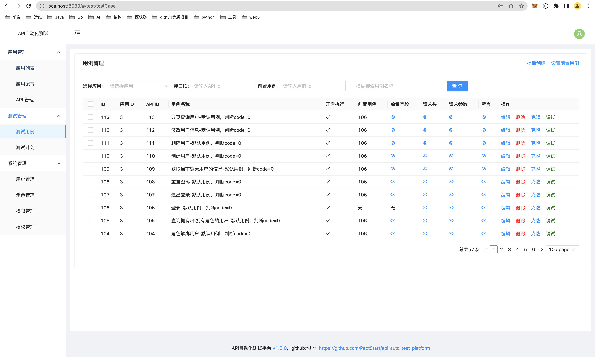

1、目录结构
```
    backend_: 一个基于Node + Express + MySQL + Redis实现的接口自动化测试平台后端
    frontend: 一个基于Vue3 + Antd实现的接口自动化测试平台前端
    executor: 一个基于Python3 + unittest实现的接口自动化运行脚本
    performance: jmeter性能测试demo
    
```
2、本地运行
```
    1）git拉取代码

    2）执行sql脚本./api_auto_test_db.sql
    
    3) 运行服务器（按照./backend/ReadMe.md执行）

    4）运行界面（按照./frontend/ReadMe.md执行）

    5）访问http://localhost:8080，初始账号密码admin/123456，admin为超级管理员账号（sys_user表的super_admin字段为1）

```

3 效果预览
        

4、安装部署
```
    运行服务端：

        1) 构建镜像
            cd backend
            docker build -t="pactstart/api_auto_test_server:1.0.0"  .
        2) 或者从dockerhub上拉取镜像（作者已经构建好上传到dockerhub）
            docker pull pactstart/api_auto_test_server:1.0.0

        3）运行镜像
            docker run -it -d -p 3000:3000 --name api_auto_test_server api_auto_test_server:1.0.0

            镜像支持多个动态配置参数，可通过-e参数动态配置：
            MYSQL_HOST：mysql数据库主机地址，默认值127.0.0.1
            MYSQL_USER：mysql数据库的连接用户，默认值root
            MYSQL_PASSWORD：mysql数据库的连接密码，默认值123456
            MYSQL_DATABASE：连接的数据库，默认值api_auto_test
            REDIS_URL: redis连接字符串，默认值redis://127.0.0.1:6379
            REDIS_PASSWORD： rdis密码，默认值123456

            如果你的redis和mysql是通过docker在本地启动的，且容器名字为redis和mysql（如果不一样，根据你的名字修改对应的参数），则可以通过下面的命令启动镜像，以确保服务端可以正常连接到redis和mysql
            docker run -it -d --link mysql:mysql_alias --link redis:redis_alias -e MYSQL_HOST=mysql_alias -e REDIS_URL="redis://redis_alias:6379" -p 3000:3000 --name api_auto_test_server pactstart/api_auto_test_server:1.0.0

    部署管理界面(上传构建产物到阿里云OSS)：

        1）修改oss.config.js中的配置

        2）修改utils/request.js中的production的接口域名路径

        3）修改vue.config.js中的配置
        
        4）运行npm run build
    
```